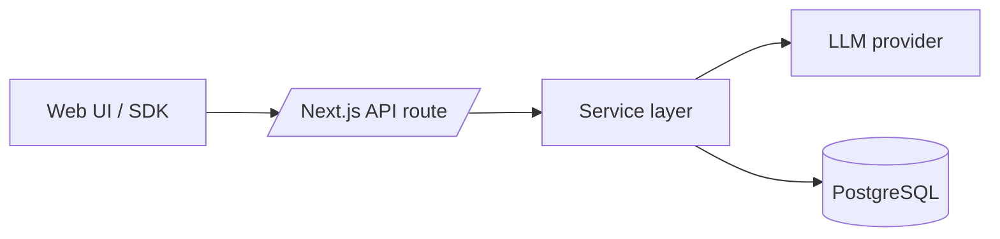

# Architecture Overview

## 1. Purpose and scope
This document explains how LangRoute is structured and how data flows through the system. It complements the high‑level [README](../README.md) and setup notes in [docs/getting-started.md](./getting-started.md).

## 2. High-level system overview
LangRoute exposes an OpenAI‑compatible chat API and a Next.js dashboard for administrators. Requests pass through thin API routes into service modules that coordinate model adapters and data access.

## 3. Components
### Web UI
- Next.js App Router under `src/app/(client)` with route groups for auth and dashboard pages. Layouts compose shared navigation and headers.
- Global providers supply React Query, NextAuth sessions and theming (see `src/app/(client)/providers/Providers.tsx`).

### API layer
- API routes live in `src/app/(server)/api`. The completions endpoint validates input and delegates to `CompletionsService` (see `src/app/(server)/api/completions/route.ts` and `src/app/(server)/api/v1/chat/completions/route.ts`).
- API handlers stay thin and rely on Zod schemas for validation (`lib/validation/*`) and `withAccessKey` middleware to enforce Access Key authentication (see `src/lib/middleware/accessKey.ts`).

### Service layer
- Business logic resides in `src/app/(server)/services`. Core services include:
  - `CompletionsService` – validates models via `ModelConfigService` and routes to LLM adapters (see `src/app/(server)/services/completions/service.ts`).
  - `AccessKeyService` – manages Access Key creation, validation, and lifecycle (see `src/app/(server)/services/accessKey/service.ts`).
  - `ModelConfigService` – validates models against the Model Registry (see `src/app/(server)/services/models/service.ts`).
- Services throw `ServiceError`, which routes convert into consistent JSON envelopes (see `src/app/(server)/services/system/errorService.ts`).

### Data layer
- Prisma client wrapper at `src/db/prisma.ts` ensures a singleton connection.
- Database schema defines users, Access Keys, and team tables (see `prisma/schema.prisma`). The `AccessKey` model stores user-generated keys for API authentication.

### Caching / realtime
- Environment supports an optional Redis connection (`REDIS_URL`) but no runtime Redis code exists yet (see `env/.env.example`).

### Middleware
- Root middleware enforces session authentication and skips public routes (see `src/middleware.ts`).
- Public route patterns are declared in `lib/middleware/publicRoutes.ts`.

### Configuration
- **Model Registry** (`@lib/config/modelRegistry`) is the single source of truth for supported models, providers, and configurations. Exports `SUPPORTED_MODELS`, `SUPPORTED_PROVIDERS`, `ProviderId`, etc.
- Environment files are merged by `scripts/prepare-env.mjs` before development runs.
- Example settings reside in `env/.env.example`.

## 4. Core request flows
### Completions
1. Client posts to `/api/completions` (canonical) or `/api/v1/chat/completions` (OpenAI-compatible proxy) with an Access Key in the `Authorization` header.
2. Route validates payload with `CompletionRequestSchema` and applies `withAccessKey` middleware (see `src/app/(server)/api/completions/route.ts` and `src/app/(server)/api/v1/chat/completions/route.ts`).
3. `CompletionsService.processCompletion` validates the model via `ModelConfigService` and routes to the appropriate `LlmAdapter` via `getAdapterForProvider()` (see `src/app/(server)/services/completions/service.ts` and `src/app/(server)/services/adapters/router.ts`).
4. Response returns to client with OpenAI-compatible format (`"object": "chat.completion"`); future versions will stream tokens.

### Admin: create Access Key
1. Dashboard page (Key Management) triggers `POST /api/access-keys`.
2. Handler authenticates user and validates request with `CreateAccessKeySchema` (see `src/app/(server)/api/access-keys/route.ts`).
3. `AccessKeyService.createAccessKey` generates and stores the Access Key via Prisma (see `src/app/(server)/services/accessKey/service.ts`).
4. JSON response returns the full Access Key once (for user to copy) and a secure preview for subsequent display in the UI.

### Logging and error handling
- Utility logger functions prefix messages consistently (see `src/lib/utils/logger.ts`).
- API routes call `handleApiError` to log and standardize error responses (see `src/app/(server)/services/system/errorService.ts`).

## 5. Layering and conventions
- Routes remain thin and delegate to services; UI logic stays client-side.
- Shared domain types live under `lib/models` (see `src/lib/models/User.ts`).
- Zod schemas in `lib/validation` define request shapes used by both client and server (see `src/lib/validation/completions.schemas.ts`).

## 6. Extensibility
- **New provider adapter:** Implement the `LlmAdapter` interface in `services/adapters/{provider}.ts` with a `complete()` method. Update `getAdapterForProvider()` in `services/adapters/router.ts` to route to your adapter. Add provider metadata to `@lib/config/modelRegistry`.
- **New models:** Add model configurations to `SUPPORTED_MODELS` in `@lib/config/modelRegistry`. The `ProviderId` type is automatically derived from the registry.
- **New API route:** create a file under `src/app/(server)/api/{name}/route.ts`, add Zod schema in `lib/validation`, and call a service module.
- **New UI feature:** add a route under `src/app/(client)/(core)` and co-locate components; export shared pieces via `components/index.ts` (see `src/app/(client)/components/index.ts`).

## 7. Performance and reliability
- Prisma logs can be enabled via `DEBUG_LOGS` environment variable for diagnostics (see `src/db/prisma.ts`).
- Docker Compose file provisions a local PostgreSQL instance with health checks (see `docker/docker-compose.db.yml`).
- Rate limiting, caching and background workers are planned but not yet implemented (see TODOs in services and env files).

## 8. Security considerations
- **Authentication**: NextAuth with credential and Google providers, storing hashed passwords (Argon2) and roles (see `src/lib/auth.ts`).
- **Access Key validation**: `withAccessKey` middleware parses bearer tokens and rejects revoked or expired Access Keys (see `src/lib/middleware/accessKey.ts` and `src/app/(server)/services/accessKey/service.ts`).
- **Provider API Keys**: Stored encrypted in the database; never logged or exposed in API responses.
- **Access Key security**: Full key shown once at creation; UI displays secure previews (partial key) thereafter.
- **Session middleware**: Blocks unauthenticated access except for public routes (see `src/middleware.ts`).
- For additional guidance see [SECURITY.md](../SECURITY.md).

## 9. Future / Planned
- Redis-backed rate limits and live log streaming.
- WebSocket gateway (`ws/`) and background workers (`workers/`).
- Usage tracking service (`api/usage`) and analytics dashboards.

## 10. Cross-links
- [README](../README.md)
- [Getting started](./getting-started.md)
- [CONTRIBUTING](../CONTRIBUTING.md)
- [CODE OF CONDUCT](../CODE_OF_CONDUCT.md)
- [SECURITY](../SECURITY.md)
- [Environment example](../env/.env.example)
