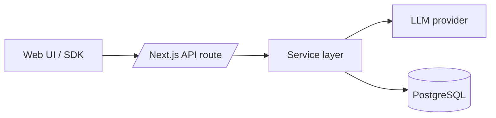

# Architecture Overview

## 1. Purpose and scope
This document explains how LangRoute is structured and how data flows through the system. It complements the high‑level [README](../README.md) and setup notes in [docs/getting-started.md](./getting-started.md).

## 2. High-level system overview
LangRoute exposes an OpenAI‑compatible chat API and a Next.js dashboard for administrators. Requests pass through thin API routes into service modules that coordinate model adapters and data access.

## 3. Components
### Web UI
- Next.js App Router under `src/app/(client)` with route groups for auth and dashboard pages. Layouts compose shared navigation and headers.
- Global providers supply React Query, NextAuth sessions and theming (see `src/app/(client)/providers/Providers.tsx`).

### API layer
- API routes live in `src/app/(server)/api`. For example, the chat completion endpoint validates input and delegates to the chat service (see `src/app/(server)/api/chat/route.ts`).
- API handlers stay thin and rely on Zod schemas for validation (`lib/validation/*`) and `withApiKey` middleware to enforce key checks (see `src/lib/middleware/apiKey.ts`).

### Service layer
- Business logic resides in `src/app/(server)/services`. `ChatService` validates models and outlines provider routing (see `src/app/(server)/services/chat/service.ts`). `ApiKeyService` encapsulates key creation and management (see `src/app/(server)/services/apiKey/service.ts`).
- Services throw `ServiceError`, which routes convert into consistent JSON envelopes (see `src/app/(server)/services/system/errorService.ts`).

### Data layer
- Prisma client wrapper at `src/db/prisma.ts` ensures a singleton connection.
- Database schema defines users, API keys and team tables (see `prisma/schema.prisma`).

### Caching / realtime
- Environment supports an optional Redis connection (`REDIS_URL`) but no runtime Redis code exists yet (see `env/.env.example`).

### Middleware
- Root middleware enforces session authentication and skips public routes (see `src/middleware.ts`).
- Public route patterns are declared in `lib/middleware/publicRoutes.ts`.

### Configuration
- Model registry and limits live in `lib/config/llmConfig.ts`.
- Environment files are merged by `scripts/prepare-env.mjs` before development runs.
- Example settings reside in `env/.env.example`.

## 4. Core request flows
### Chat completions
1. Client posts to `/api/chat`.
2. Route validates payload with `ChatCompletionSchema` and applies API key middleware (see `src/app/(server)/api/chat/route.ts`).
3. `ChatService.processCompletion` checks model config and would route to a provider (placeholder) (see `src/app/(server)/services/chat/service.ts`).
4. Response returns to client; future versions may stream tokens.

### Admin: create API key
1. Dashboard page triggers `POST /api/apikeys`.
2. Handler authenticates user and validates request (see `src/app/(server)/api/apikeys/route.ts`).
3. `ApiKeyService.createApiKey` generates and stores the key via Prisma (see `src/app/(server)/services/apiKey/service.ts`).
4. JSON response returns key preview for display in the UI.

### Logging and error handling
- Utility logger functions prefix messages consistently (see `src/lib/utils/logger.ts`).
- API routes call `handleApiError` to log and standardize error responses (see `src/app/(server)/services/system/errorService.ts`).

## 5. Layering and conventions
- Routes remain thin and delegate to services; UI logic stays client-side.
- Shared domain types live under `lib/models` (see `src/lib/models/User.ts`).
- Zod schemas in `lib/validation` define request shapes used by both client and server (see `src/lib/validation/chat.schemas.ts`).

## 6. Extensibility
- **New provider adapter:** implement logic in `services/adapters` and have `ChatService` route to it (folder exists, implementation pending). Add provider metadata to `lib/config/llmConfig.ts`.
- **New API route:** create a file under `src/app/(server)/api/{name}/route.ts`, add Zod schema in `lib/validation`, and call a service module.
- **New UI feature:** add a route under `src/app/(client)/(core)` and co-locate components; export shared pieces via `components/index.ts` (see `src/app/(client)/components/index.ts`).

## 7. Performance and reliability
- Prisma logs can be enabled via `DEBUG_LOGS` environment variable for diagnostics (see `src/db/prisma.ts`).
- Docker Compose file provisions a local PostgreSQL instance with health checks (see `docker/docker-compose.db.yml`).
- Rate limiting, caching and background workers are planned but not yet implemented (see TODOs in services and env files).

## 8. Security considerations
- Authentication uses NextAuth with credential and Google providers, storing hashed passwords and roles (see `src/lib/auth.ts`).
- API key middleware parses bearer tokens and rejects revoked or expired keys (see `src/lib/middleware/apiKey.ts` and `src/app/(server)/services/apiKey/service.ts`).
- Middleware blocks unauthenticated access except for public routes (see `src/middleware.ts`).
- For additional guidance see [SECURITY.md](../SECURITY.md).

## 9. Future / Planned
- Redis-backed rate limits and live log streaming.
- WebSocket gateway (`ws/`) and background workers (`workers/`).
- Usage tracking service (`api/usage`) and analytics dashboards.

## 10. Cross-links
- [README](../README.md)
- [Getting started](./getting-started.md)
- [CONTRIBUTING](../CONTRIBUTING.md)
- [CODE OF CONDUCT](../CODE_OF_CONDUCT.md)
- [SECURITY](../SECURITY.md)
- [Environment example](../env/.env.example)
